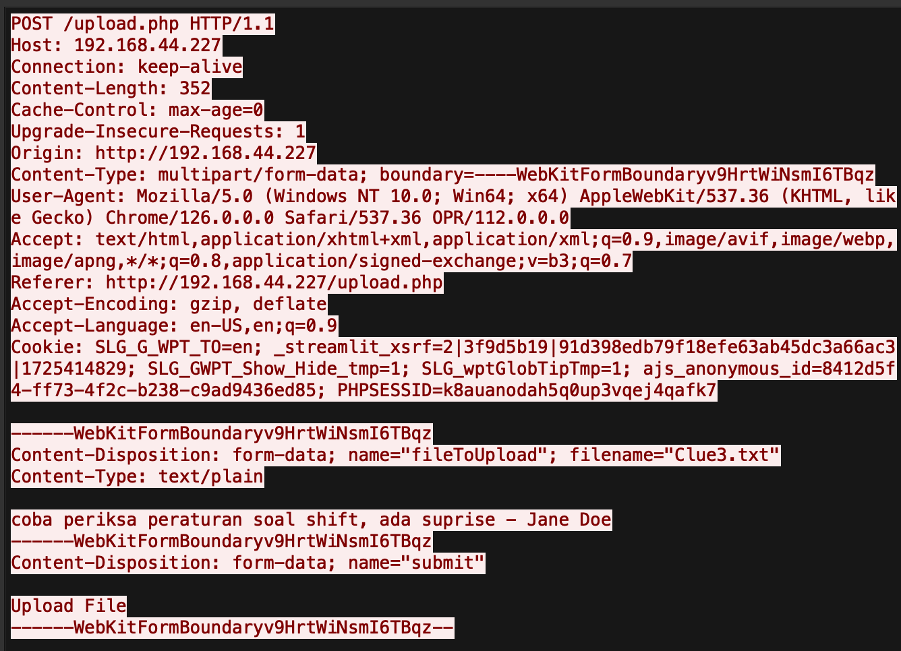
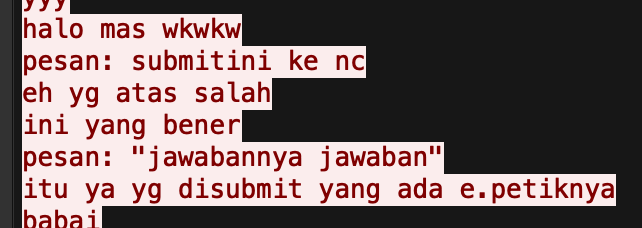
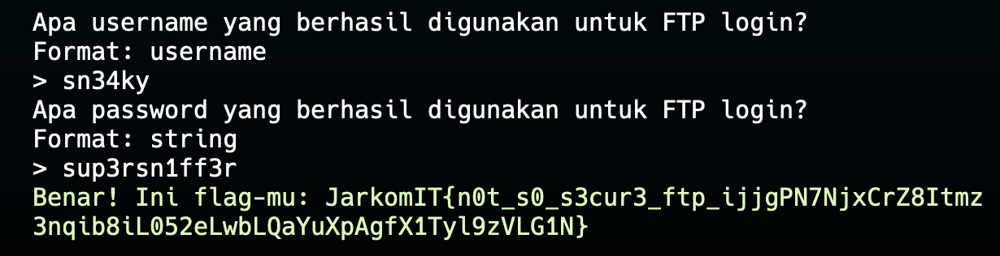
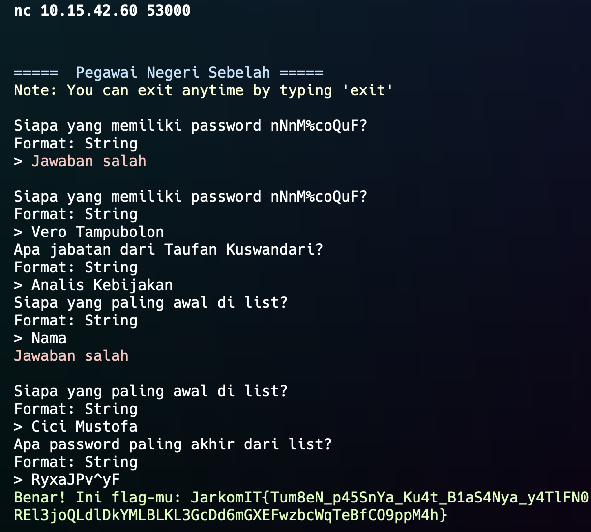
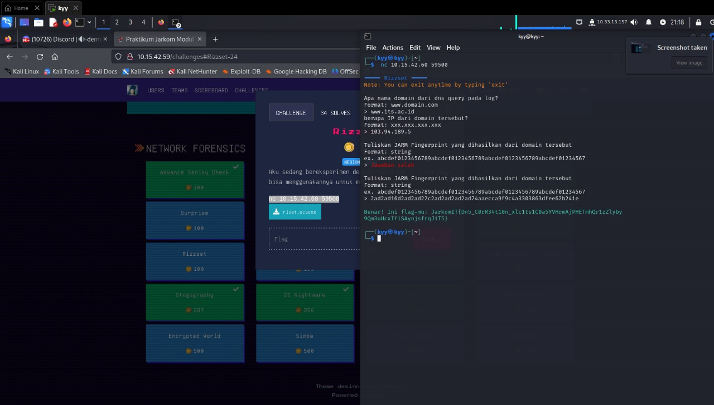

# Jarkom-1-2024-IT31

## Anggota Kelompok IT31 :

| Nama Lengkap         | NRP        |
| -------------------- | ---------- |
| Maulana Ahmad Zahiri | 5027231010 |
| Dzaky Faiq Fayyadhi  | 5027231047 |

## Write Up

- [Advance Sanity Check](#advance-sanity-check)
- [EZ](#ez)
- [FTP Login](#ftp-login)
- [Pegawai Negeri Sebelah](#pegawai-negeri-sebelah)
- [Illegal Breakthrough](#illegal-breakthrough)
- [Packets Barrage](#packets-barrage)
- [innerRCE](#innerrce)
- [Stegography](#stegography)
- [Rizzset](#rizzset)
- [Gajah Terbang (Server Recon)](#gajah-terbang-server-recon)
- [Gajah Terbang (Attacker Recon)](#gajah-terbang-attacker-recon)
- [Baby Hengker](#baby-hengker)
- [Adult Hengker](#adult-hengker)
- [Surprise](#surprise)
- [Malicious Code](#malicious-code)
- [Corporate Breach](#corporate-breach)

# Advance Sanity Check

- tcp contains "username"

- http.request.method == "POST"

- http contains ".php"

- http contains "Clue3.txt"

`cGVud29yZA==` Kemudian lanjut decode kata tersebut pada platform decode sehingga menghasilkan string = penword

lalu terdapat flag berupa :
`flag-mu: JarkomIT{8uK4n_S4n1ty_b1a5A_nNg9t4F2b5hhjWnYXz3rtRo57Su5g7MTESM91HNORWKx7soLpZ3CRIKK}`

## EZ

- tcp > follow > tcp stream,
- lalu terdapat “jawabannya jawaban”

- kemudian untuk port 1234 dari bilah kiri bawah

`Benar! Ini flag-mu: JarkomIT{BiAr_aman_Pake_sSh_XkqtsFzqvkQN7WGDVpVdCwQwp3zfWapqYj6r4REavoAUP7YwIAcDEZ}
`

## FTP login:

Mencari login successful

Lalu terdapat username dan passwordnya



## Pegawai Negeri Sebelah

tcp contain “nNnM%coQuF”terus find nNnM%coQuF, lalu input Vero Tampubolon

Lalu search taufan, dan mendapatkan jabatab berupa Analis Kebijakan

Lalu menampilkan yang paling awal dan paling akhir

`Benar! Ini flag-mu: JarkomIT{Tum8eN_p45SnYa_Ku4t_B1aS4Nya_y4TlFN0REl3joQLdlDkYMLBLKL3GcDd6mGXEFwzbcWqTeBfCO9ppM4h}`



# Illegal Breakthrough

1.  Tcp contains”.php”

2.  

3.  Ip address korban ada di Host : 172.21.88.207

4.  Port yang digunakan sebagai webserver ada di Host : 1917

5.  Dimana endpoint ada di paling atas /ww1.php

6.  Tools apa yang digunakan oleh attacker?
    

Fuzz Faster U Fool v2.1.0-dev disingkat ffuf-v2.1.0-dev

7. Apa kredesial yang berhasil digunakan oleh hacker
   Redbaron:fly1ng4c3

## Packets Barrage

1. IP Address Attacker ada di Source ketika membuka file

2. Berapa total attempt?

   cari menggunakan http.response.code == 200

   

3. Apa nama file yang didownload oleh hacker?

   File > Export Object > http > Filter R > Save > Extract

4. Apa isi dari file ?

tinggal buka

## InnerRCE

1. frame contains "POST"

   

   UTC beda 7 jam jadi

2. Nyari 1 1 sampe ke stream 55 ada server-app

3. idzoyyshell.php

4. 
   di stream 49 ada bakuls dia menggunakan whoami

5. 

   di stream 52 copas yang di antara %20()%20 trus decrypt menggunakan base 64 = pls rate soal ini

## 22 Nightmare

1. tcp contains "USER" ada di stream 3

   Sh1k4.jpg

2. File yang dikirim?

   File > Export trus buka gambarnya di dalam ada tulisan NUN

3. Ada di stream 141 noko.py

4. 

itu di stream 142 ada input binary kita decrypt menggunakan XOR dan gunakan string NUN ubah ke binary dulu untuk di jadikan Key

## Stegography

1. frame contains ".png" jumlah 13

2. kemudian reverse.py eksekusi dengan image.open di ganti pathnya jadi nama file

3. kemudian cari 1 1 dan ditemukan ada pesan di ATP, EH, KJK

4. kemudian gabungkan pesannya dengan di balik isinya pahlawan keamanan siber

## Rizzset

Aku sedang bereksperimen dengan suatu tools, kamu juga bisa menggunakannya untuk menjawab soal ini

pertanyaan :

- domain memakai ww.its.ac.id
- ip dari domain adalah 103.94.189.5
- Jarm Fingerprint yang dihasilkan yakni,

Tuliskan JARN Fingerprint yang dihasilkan dari domain tersebut

Format: string

ex. abcdef0123456789abcdef@123456789abcdef@123456789abcdef@1234567

Jawaban salah

Format: string

Tuliskan JARM Fingerprint yang dihasilkan dari domain tersebut
2626166222222262ad74aaecca9f9c4a3363063df0o626241e (didapat dari program jar pada domain))

`Benar! Ini flag-pu: JarkomIT(Dn5 CarR34t1@n_xlc1ts1C8a5YVWcwAjPHETshQr1zZlyby 9Qn3uUcxIfiSAyn FrqJ1T5)`

## Gajah Terbang (Server Recon)

- Apa DBMS yang digunakan pada server tersebut?

Format: string ex. MonggoDB

> PostgreSQL

- Di port berapa DBMS server tersebut berjalan?

Format: xxxx ex. 443

>

- Di port berapa DBMS server tersebut berjalan?

Format: xxxx ex. 443

> 6969

- OS apa yang digunakan untuk server tersebut?

Format: string ex. linux

> Debian

- Apa credentials username DBMS valid yang digunakan?

Format: string

> s1gm4

- apa nama database yang digunakan?

Format: string

> sigmaskibidigyatrizzzz

- Ada berapa banyak users dalam database tersebut?

Format: number

> 4

- Apa email yang digunakan oleh admin?

Format: email@gmail.com

> jojohermawan@gmail.com

- Apa password yang digunakan oleh admin?

Format: string

> admin1234

`Benar! Ini flag-mu: JarkomIT{Gy4tT_MSg_4U_TuX7rcPvGcP80cGl5FjvzsM9d5k1XDoBy@ABEG9xiz4vjrmZsGKSvBiD1}`

## Gajah Terbang (Attacker Recon)

Akun apa yang dimiliki oleh penyerang dalam database tersebut, berikan emailnya!
Format: user@gmail.com

> kuntoajiisrillll@gmail.com

- Apa password yang digunakan oleh penyerang?
  > Format: string
  > kissme
- Pada tanggal berapa akun penyerang diban?
  > Format: YYYY-MM-DD
  > 2024-06-09
- Table apa saja yang dimodifikasi oleh penyerang?

  > users dan banned_users

- Barang apa saja yang telah dibeli oleh penyerang?
  Format: string dan string

  > rokok dan es krim

- Berapa total transaksi dari barang yang dibeli oleh penyerang?
  Format: number
  > 24500

`Benar! Ini flag-mu: JarkomIT{G4jaH_K0k_t3RbaNG_G4LXnZOdIQjTT1Ip8kUBBFHp9YntftOxvKqxwazS31R2fJw09blNjKt5}`

## Baby Hengker

- Kapan hacker tersebut mengakses komputer yang ada di lab?
  Format: YYYY-MM-DD HH:MM
  ex. 1945-08-17 21:21
  ⁠2024-09-16 13:43
- Apa yang dituliskan oleh hacker tersebut?
  Format: string ex. kata kata
  ⁠ini passwordnya apa ya?

`Benar! Ini flag-mu: JarkomIT{4ku_p9n_j4d1_h3n9k3r_p3aumcGdVWFkF7Lh4fyAf91g4Am1t7CBCwBze05T2XFatRdf2WGdiHCK}`

## Adult Hengker

- Apakah device yang digunakan oleh seorang mahasiswa tersebut?

Format: string

> Mouse

- Apakah device yang digunakan oleh seorang mahasiswa tersebut?

Format: STRING

> HALO MAS KEVIN SALKEN

`Benar! Ini flag-mu: JarkomIT{d0n7_wr173_r4nd0m1y_Obwq4F67R1XD8jijYwGo8V6GDm45iyk7dr8DdosTYaSvOs5mHJHjrK3v1n}`

## Surprise

- Apa service yang digunakan pada FTP server?
  Format: service ver
  ex. proFTPd 1.1.0
  ⁠vsFTPd 3.0.3

- Apa nama file yang dikirim oleh attacker?
  Format: filename.extension
  ⁠Jawaban salah

- Apa nama file yang dikirim oleh attacker?
  Format: filename.extension
  ⁠g0tcha.cpp

- Apa pesan rahasia yang ditinggalkan oleh attacker?
  Format: string ex. h4lo wor1d
  ⁠g0tchu n0w littl3 m0us3
  Jawaban salah

- Apa pesan rahasia yang ditinggalkan oleh attacker?
  Format: string ex. h4lo wor1d
  ⁠g0tchu n0w l1ttl3 m0us3

`Benar! Ini flag-mu: JarkomIT{l1ttl3_m0us3_1n_th3_h0us3_UugLdNZzQaEsZfH2pcnxG9cegG0jkSgJlXYRY9LTFnbaC0gSgofhTCHU}`

## Malicious Code

- Berapa total attempt attacker melakukan dir listing?

  ⁠52

- Apa endpoint yang berhasil attacker dapatkan untuk login page?

  ⁠/index.php

- Pada attempt ke berapa attacker menemukan email dan password yang benar?

  ⁠153

- Apa jawaban dari pertanyaan sang attacker?

  ⁠merah

`Benar! Ini flag-mu: JarkomIT{s3cr3t_m3ss4ge_fr0m_4uth0r_rsq8pIMuleESbWferuIopa40JC0qsdyHww8yvdltvBolAmFWWESSL0R}`

## Corporate Breach

Corporate Breach

- Siapa nama attacker?

  ⁠Nakhimov

- Apa email yang digunakan untuk login?
  Format: email@gmail.com
  ⁠jarkomsupport@gmail.com

- Apa password yang digunakan untuk login?

  ⁠j4rk0mg4c0rbg

`Benar! Ini flag-mu: JarkomIT{supp0rt_k0k_l3m4h_bg_ansey5ioRbxqubhfVYjSV7jvqG6H7X2OEQDFhwuGP7rH0qyJxBqVG6}`
